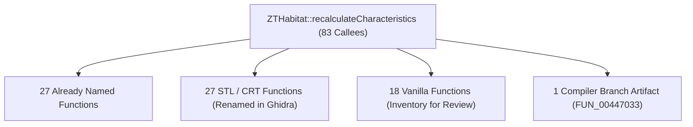

# ZTHabitat::recalculateCharacteristics Comparative Analysis & Function Inventory

## Executive Overview

A comprehensive reverse engineering analysis of `ZTHabitat::recalculateCharacteristics` was conducted comparing the Windows binary (`zoo.exe`, entry point `0x00444827`) against the macOS binary (`Zoo Tycoon CC (macos)`, PEF PowerPC, entry point `0x100a8a30`).

A total of **83 callees** were mapped across both binaries through decompiled high-Pcode graph traversal, branch analysis, and cross-platform control flow matching:

- **27 Functions** already possessed correct canonical names (e.g. `getSize`, `hasBldg`, `reviseSpeciesList`, `constructSurroundingSpeciesList`, `getSurroundingAnimals`, `addFoundSpecies`, `sendMaintWorkerCleanupEvents`).
- **27 STL / CRT Template Functions** that were misidentified or left as raw `FUN_...` addresses were **directly renamed in Ghidra** under the `msvc_std::...` namespace following established project conventions.
- **18 Vanilla Zoo Tycoon Functions** were identified, categorized, and cataloged into this inventory with cross-platform verification for manual review.
- **1 Compiler Artifact** (`FUN_00447033`) was confirmed to be a compiler jump fragment / basic block split within `recalculateCharacteristics` rather than an independent subroutine.



## Part 1: Vanilla Zoo Tycoon Functions Inventory (For Manual Review)

Below is the complete inventory of the 18 Vanilla Zoo Tycoon functions called by `recalculateCharacteristics`.

| Windows Addr | Current Ghidra Symbol | macOS Match / Symbol | Proposed Function Name & Prototype | Purpose & Implementation Details |
| :--- | :--- | :--- | :--- | :--- |
| `0x00410e20` | `FUN_00410e20` | `_BFEntityTypeCast<>__FP12BFEntityType_P12ZTAnimalType` | `ZTAnimalType* BFEntityTypeCast<ZTAnimalType>(BFEntityType* type)` | Dynamic typecast verifying if a BFEntityType represents an animal type. Calls virtual method at offset +0x1c with static RTTI descriptor &CAST_ZTAnimal. |
| `0x004460bc` | `FUN_004460bc` | `_BFEntityCast<8ZTKeeper>__FP8BFEntity_P8ZTKeeper` | `ZTKeeper* BFEntityCast<ZTKeeper>(BFEntity* entity)` | Dynamic entity downcast verifying if an active entity is a ZTKeeper. Inspects entity descriptor at entity+0x128 and calls virtual method +0x1c with &CAST_ZTKeeper. |
| `0x00446429` | `FUN_00446429` | `Inlined global lookup (PTR_DAT_102da0f4)` | `ZTWorldMgr* ZTApp::getWorldMgr(void)` | Returns the global ZTWorldMgr singleton pointer (GLOBAL_ZTWorldMgr at DAT_00638048). Used in keeper assignment scanning. |
| `0x0044642f` | `OOAnalyzer::cls_0x44642f::meth_0x44642f` | `Inlined vector getter (*(int*)PTR_DAT_102da0f4 + 0x98)` | `std::vector<ZTStaff*>* ZTWorldMgr::getStaffList(void)` | Returns pointer to the staff entity vector at offset +0x80 of ZTWorldMgr (+0x98 in macOS). Misidentified by OOAnalyzer as cls_0x44642f. |
| `0x0044699a` | `FUN_0044699a` | `Inlined formula (100a9448-100a94b4)` | `int ZTHabitat::calcRequiredTilesForPercentage(char active, int target_pct, int current_tiles, int total_tiles, int max_limit)` | Computes additional required tiles to fulfill target suitability percentage: ((target_pct * (total - current)) / (100 - target_pct)) - current, clamped to [0, max_limit]. Inlined by Apple compiler on macOS. |
| `0x00446c46` | `OOAnalyzer::cls_0x446c46::meth_0x446c46` | `Inlined offset (*piVar10 + 0x288)` | `BFCategory* ZTAnimalType::getCategoryList(void)` | Accessor returning pointer to category list attribute container (&this->mbr_0x2c0) in ZTAnimalType (+0x288 in macOS). |
| `0x00446c8c` | `OOAnalyzer::cls_0x446c8c::meth_0x446c8c` | `Inlined offset (*piVar10 + 0x1b4)` | `int ZTAnimalType::getSpeciesID(void)` | Returns 4-byte species identification number (this->mbr_0x1ec) from ZTAnimalType (+0x1b4 in macOS). |
| `0x00446c93` | `OOAnalyzer::ZTBuilding::meth_0x446c93` | `Inlined flag check (*(char*)(iVar27 + 0x33d))` | `bool ZTBuilding::isPlacementValid(void)` | Accessor checking boolean entity validity flag at offset +0x395 on ZTBuilding (+0x33d in macOS). |
| `0x00446c9a` | `OOAnalyzer::ZTBuilding::meth_0x446c9a` | `Inlined animal cast & anim root check` | `void ZTBuilding::isAnimalOrAnimalTarget(void)` | Checks if the building entity type is castable to ZTAnimal and retrieves animation root coordinates. |
| `0x00446ce1` | `FUN_00446ce1` | `Inlined dummy check with DAT_006393c8` | `bool ZTSpecies::isSpecialDummySpecies(int species_ptr)` | Compares species ID at offset +0x1ec against global dummy sentinel species ID DAT_006393c8. |
| `0x004470e0` | `OOAnalyzer::ZTBuilding::meth_0x4470e0` | `Inlined offset (*(int*)(iVar15 + 0xf0))` | `BFEntityType* BFEntity::getEntityType(void)` | Accessor returning BFEntityType pointer from entity offset +0xf0 ((this->cls_0x62d950).cls_0x62d4b4.entity_type). |
| `0x00493bcb` | `OOAnalyzer::ZTTankExhibit::meth_0x493bcb` | `Inlined field (*(uint*)(param_1 + 0x1bc))` | `int ZTTankExhibit::getMaxWaterDepth(void)` | Returns maximum tank water level/depth parameter at field_0x1a8 of ZTTankExhibit (+0x1bc in macOS). |
| `0x00493c5c` | `OOAnalyzer::cls_0x493c5c::meth_0x493c5c` | `Inlined field (*(uint*)(*piVar10 + 0x334))` | `int ZTAnimalType::getMaxWaterDepth(void)` | Returns maximum suitable water depth (mbr_0x360) for the animal species (+0x334 in macOS). |
| `0x00493d79` | `OOAnalyzer::cls_0x493c5c::meth_0x493d79` | `Inlined field (*(uint*)(*piVar10 + 0x330))` | `int ZTAnimalType::getMinWaterDepth(void)` | Returns minimum suitable water depth (mbr_0x35c) for the animal species (+0x330 in macOS). |
| `0x0058ca7b` | `OOAnalyzer::cls_0x446c8c::meth_0x58ca7b` | `Inlined field (*(int*)(iVar28 + 0x1e8))` | `int ZTAnimalType::getSuitabilityAttrib1(void)` | Returns primary suitability attribute / foliage category index (mbr_0x1e8) from ZTAnimalType (+0x1e8 in macOS). |
| `0x0058cae1` | `OOAnalyzer::cls_0x446c8c::meth_0x58cae1` | `Inlined field (*(int*)(iVar28 + 0x1e4))` | `int ZTAnimalType::getSuitabilityAttrib2(void)` | Returns secondary suitability attribute / terrain category index (mbr_0x1e4) from ZTAnimalType (+0x1e4 in macOS). |
| `0x00507150` | `OOAnalyzer::ZTHabitat::meth_0x507150` | `addToBuildingList (100a9fa0)` | `void ZTHabitat::addToBuildingList(ZTBuildingType* bldg, int count)` | Filters and registers building / scenery types into the habitat building inventory (previously identified in global inventory). |
| `0x00507645` | `OOAnalyzer::ZTHabitat::meth_0x507645` | `additionalScenerySuitabilityChange (100aa350)` | `float ZTHabitat::additionalScenerySuitabilityChange(ZTAnimalType* animal, int* count)` | Evaluates suitability score contributions from scenery items present in the habitat (previously identified in global inventory). |

## Part 2: Detailed Technical Analysis of Vanilla Functions

### `ZTAnimalType* BFEntityTypeCast<ZTAnimalType>(BFEntityType* type)` (`0x00410e20`)

- **Current Ghidra Symbol**: `FUN_00410e20`
- **macOS Equivalent**: `_BFEntityTypeCast<>__FP12BFEntityType_P12ZTAnimalType`
- **Instruction Count**: 16 instructions
- **Technical Description**: Dynamic typecast verifying if a BFEntityType represents an animal type. Calls virtual method at offset +0x1c with static RTTI descriptor &CAST_ZTAnimal.

**Windows Decompiled C Code**:
```c

int * __cdecl FUN_00410e20(int *param_1)

{
  char cVar1;
  
  if (param_1 != (int *)0x0) {
    cVar1 = (**(code **)(*param_1 + 0x1c))(&CAST_ZTAnimal);
    if (cVar1 != '\0') {
      return param_1;
    }
  }
  return (int *)0x0;
}

```

### `ZTKeeper* BFEntityCast<ZTKeeper>(BFEntity* entity)` (`0x004460bc`)

- **Current Ghidra Symbol**: `FUN_004460bc`
- **macOS Equivalent**: `_BFEntityCast<8ZTKeeper>__FP8BFEntity_P8ZTKeeper`
- **Instruction Count**: 16 instructions
- **Technical Description**: Dynamic entity downcast verifying if an active entity is a ZTKeeper. Inspects entity descriptor at entity+0x128 and calls virtual method +0x1c with &CAST_ZTKeeper.

**Windows Decompiled C Code**:
```c

int __cdecl FUN_004460bc(int param_1)

{
  char cVar1;
  
  if (param_1 != 0) {
    cVar1 = (**(code **)(**(int **)(param_1 + 0x128) + 0x1c))(&CAST_ZTKeeper);
    if (cVar1 != '\0') {
      return param_1;
    }
  }
  return 0;
}

```

### `ZTWorldMgr* ZTApp::getWorldMgr(void)` (`0x00446429`)

- **Current Ghidra Symbol**: `FUN_00446429`
- **macOS Equivalent**: `Inlined global lookup (PTR_DAT_102da0f4)`
- **Instruction Count**: 2 instructions
- **Technical Description**: Returns the global ZTWorldMgr singleton pointer (GLOBAL_ZTWorldMgr at DAT_00638048). Used in keeper assignment scanning.

**Windows Decompiled C Code**:
```c

ZTWorldMgr * FUN_00446429(void)

{
  return GLOBAL_ZTWorldMgr;
}

```

### `std::vector<ZTStaff*>* ZTWorldMgr::getStaffList(void)` (`0x0044642f`)

- **Current Ghidra Symbol**: `OOAnalyzer::cls_0x44642f::meth_0x44642f`
- **macOS Equivalent**: `Inlined vector getter (*(int*)PTR_DAT_102da0f4 + 0x98)`
- **Instruction Count**: 2 instructions
- **Technical Description**: Returns pointer to the staff entity vector at offset +0x80 of ZTWorldMgr (+0x98 in macOS). Misidentified by OOAnalyzer as cls_0x44642f.

**Windows Decompiled C Code**:
```c

int __thiscall OOAnalyzer::cls_0x44642f::meth_0x44642f(cls_0x44642f *this)

{
  return (int)&this->mbr_0x80;
}

```

### `int ZTHabitat::calcRequiredTilesForPercentage(char active, int target_pct, int current_tiles, int total_tiles, int max_limit)` (`0x0044699a`)

- **Current Ghidra Symbol**: `FUN_0044699a`
- **macOS Equivalent**: `Inlined formula (100a9448-100a94b4)`
- **Instruction Count**: 39 instructions
- **Technical Description**: Computes additional required tiles to fulfill target suitability percentage: ((target_pct * (total - current)) / (100 - target_pct)) - current, clamped to [0, max_limit]. Inlined by Apple compiler on macOS.

**Windows Decompiled C Code**:
```c

int __cdecl FUN_0044699a(char param_1,int param_2,int param_3,int param_4,int param_5)

{
  int iVar1;
  int *piVar2;
  int iVar3;
  
  if (param_1 == '\0') {
    return 0;
  }
  if (param_2 < 1) {
    return 0;
  }
  if (param_2 != 100) {
    iVar1 = (param_4 - param_3) * param_2;
    iVar3 = 100 - param_2;
    param_2 = 0;
    _param_1 = iVar1 / iVar3 - param_3;
    piVar2 = &param_5;
    if (_param_1 <= param_5) {
      piVar2 = (int *)&param_1;
    }
    if (*piVar2 < 1) {
      piVar2 = &param_2;
```

### `BFCategory* ZTAnimalType::getCategoryList(void)` (`0x00446c46`)

- **Current Ghidra Symbol**: `OOAnalyzer::cls_0x446c46::meth_0x446c46`
- **macOS Equivalent**: `Inlined offset (*piVar10 + 0x288)`
- **Instruction Count**: 2 instructions
- **Technical Description**: Accessor returning pointer to category list attribute container (&this->mbr_0x2c0) in ZTAnimalType (+0x288 in macOS).

**Windows Decompiled C Code**:
```c

int __thiscall OOAnalyzer::cls_0x446c46::meth_0x446c46(cls_0x446c46 *this)

{
  return (int)&this->mbr_0x2c0;
}

```

### `int ZTAnimalType::getSpeciesID(void)` (`0x00446c8c`)

- **Current Ghidra Symbol**: `OOAnalyzer::cls_0x446c8c::meth_0x446c8c`
- **macOS Equivalent**: `Inlined offset (*piVar10 + 0x1b4)`
- **Instruction Count**: 2 instructions
- **Technical Description**: Returns 4-byte species identification number (this->mbr_0x1ec) from ZTAnimalType (+0x1b4 in macOS).

**Windows Decompiled C Code**:
```c

dword __thiscall OOAnalyzer::cls_0x446c8c::meth_0x446c8c(cls_0x446c8c *this)

{
  return this->mbr_0x1ec;
}

```

### `bool ZTBuilding::isPlacementValid(void)` (`0x00446c93`)

- **Current Ghidra Symbol**: `OOAnalyzer::ZTBuilding::meth_0x446c93`
- **macOS Equivalent**: `Inlined flag check (*(char*)(iVar27 + 0x33d))`
- **Instruction Count**: 2 instructions
- **Technical Description**: Accessor checking boolean entity validity flag at offset +0x395 on ZTBuilding (+0x33d in macOS).

**Windows Decompiled C Code**:
```c

byte __thiscall OOAnalyzer::ZTBuilding::meth_0x446c93(ZTBuilding *this)

{
  return this->mbr_0x395;
}

```

### `void ZTBuilding::isAnimalOrAnimalTarget(void)` (`0x00446c9a`)

- **Current Ghidra Symbol**: `OOAnalyzer::ZTBuilding::meth_0x446c9a`
- **macOS Equivalent**: `Inlined animal cast & anim root check`
- **Instruction Count**: 20 instructions
- **Technical Description**: Checks if the building entity type is castable to ZTAnimal and retrieves animation root coordinates.

**Windows Decompiled C Code**:
```c

void __thiscall OOAnalyzer::ZTBuilding::meth_0x446c9a(ZTBuilding *this)

{
  BFEntityType *this_00;
  bool bVar1;
  void *unaff_ESI;
  
  this_00 = (this->cls_0x62d950).cls_0x62d4b4.entity_type;
  if (this_00 != (BFEntityType *)0x0) {
    bVar1 = (*this_00->vftptr_0x0->isCastClass)(this_00,(char *)&CAST_ZTAnimal);
    if (bVar1) {
      (*this_00->vftptr_0x0[1].getAnimRoot)(this_00,unaff_ESI);
      return;
    }
  }
  (**(code **)(iRam00000000 + 0xcc))();
  return;
}

```

### `bool ZTSpecies::isSpecialDummySpecies(int species_ptr)` (`0x00446ce1`)

- **Current Ghidra Symbol**: `FUN_00446ce1`
- **macOS Equivalent**: `Inlined dummy check with DAT_006393c8`
- **Instruction Count**: 7 instructions
- **Technical Description**: Compares species ID at offset +0x1ec against global dummy sentinel species ID DAT_006393c8.

**Windows Decompiled C Code**:
```c

bool __cdecl FUN_00446ce1(int param_1)

{
  return *(int *)(param_1 + 0x1ec) == DAT_006393c8;
}

```

### `BFEntityType* BFEntity::getEntityType(void)` (`0x004470e0`)

- **Current Ghidra Symbol**: `OOAnalyzer::ZTBuilding::meth_0x4470e0`
- **macOS Equivalent**: `Inlined offset (*(int*)(iVar15 + 0xf0))`
- **Instruction Count**: 2 instructions
- **Technical Description**: Accessor returning BFEntityType pointer from entity offset +0xf0 ((this->cls_0x62d950).cls_0x62d4b4.entity_type).

**Windows Decompiled C Code**:
```c

BFEntityType * __thiscall OOAnalyzer::ZTBuilding::meth_0x4470e0(ZTBuilding *this)

{
  return (this->cls_0x62d950).cls_0x62d4b4.entity_type;
}

```

### `int ZTTankExhibit::getMaxWaterDepth(void)` (`0x00493bcb`)

- **Current Ghidra Symbol**: `OOAnalyzer::ZTTankExhibit::meth_0x493bcb`
- **macOS Equivalent**: `Inlined field (*(uint*)(param_1 + 0x1bc))`
- **Instruction Count**: 2 instructions
- **Technical Description**: Returns maximum tank water level/depth parameter at field_0x1a8 of ZTTankExhibit (+0x1bc in macOS).

**Windows Decompiled C Code**:
```c

undefined4 __thiscall OOAnalyzer::ZTTankExhibit::meth_0x493bcb(ZTTankExhibit *this)

{
  return *(undefined4 *)&(this->cls_0x632100).field_0x1a8;
}

```

### `int ZTAnimalType::getMaxWaterDepth(void)` (`0x00493c5c`)

- **Current Ghidra Symbol**: `OOAnalyzer::cls_0x493c5c::meth_0x493c5c`
- **macOS Equivalent**: `Inlined field (*(uint*)(*piVar10 + 0x334))`
- **Instruction Count**: 2 instructions
- **Technical Description**: Returns maximum suitable water depth (mbr_0x360) for the animal species (+0x334 in macOS).

**Windows Decompiled C Code**:
```c

dword __thiscall OOAnalyzer::cls_0x493c5c::meth_0x493c5c(cls_0x493c5c *this)

{
  return this->mbr_0x360;
}

```

### `int ZTAnimalType::getMinWaterDepth(void)` (`0x00493d79`)

- **Current Ghidra Symbol**: `OOAnalyzer::cls_0x493c5c::meth_0x493d79`
- **macOS Equivalent**: `Inlined field (*(uint*)(*piVar10 + 0x330))`
- **Instruction Count**: 2 instructions
- **Technical Description**: Returns minimum suitable water depth (mbr_0x35c) for the animal species (+0x330 in macOS).

**Windows Decompiled C Code**:
```c

dword __thiscall OOAnalyzer::cls_0x493c5c::meth_0x493d79(cls_0x493c5c *this)

{
  return this->mbr_0x35c;
}

```

### `int ZTAnimalType::getSuitabilityAttrib1(void)` (`0x0058ca7b`)

- **Current Ghidra Symbol**: `OOAnalyzer::cls_0x446c8c::meth_0x58ca7b`
- **macOS Equivalent**: `Inlined field (*(int*)(iVar28 + 0x1e8))`
- **Instruction Count**: 2 instructions
- **Technical Description**: Returns primary suitability attribute / foliage category index (mbr_0x1e8) from ZTAnimalType (+0x1e8 in macOS).

**Windows Decompiled C Code**:
```c

dword __thiscall OOAnalyzer::cls_0x446c8c::meth_0x58ca7b(cls_0x446c8c *this)

{
  return this->mbr_0x1e8;
}

```

### `int ZTAnimalType::getSuitabilityAttrib2(void)` (`0x0058cae1`)

- **Current Ghidra Symbol**: `OOAnalyzer::cls_0x446c8c::meth_0x58cae1`
- **macOS Equivalent**: `Inlined field (*(int*)(iVar28 + 0x1e4))`
- **Instruction Count**: 2 instructions
- **Technical Description**: Returns secondary suitability attribute / terrain category index (mbr_0x1e4) from ZTAnimalType (+0x1e4 in macOS).

**Windows Decompiled C Code**:
```c

dword __thiscall OOAnalyzer::cls_0x446c8c::meth_0x58cae1(cls_0x446c8c *this)

{
  return this->mbr_0x1e4;
}

```

### `void ZTHabitat::addToBuildingList(ZTBuildingType* bldg, int count)` (`0x00507150`)

- **Current Ghidra Symbol**: `OOAnalyzer::ZTHabitat::meth_0x507150`
- **macOS Equivalent**: `addToBuildingList (100a9fa0)`
- **Instruction Count**: 178 instructions
- **Technical Description**: Filters and registers building / scenery types into the habitat building inventory (previously identified in global inventory).

**Windows Decompiled C Code**:
```c

void __thiscall
OOAnalyzer::ZTHabitat::addToBuildingList(ZTHabitat *this,int **param_1,ZTHabitat *param_2)

{
  int *piVar1;
  int **ppiVar2;
  char cVar3;
  int *piVar4;
  int *piVar5;
  uint uVar6;
  int ***pppiVar7;
  int iVar8;
  int *piVar9;
  int **ppiVar10;
  bool bVar11;
  int *local_1c;
  int local_14;
  int local_10;
  int **ppiStack_c;
  int *local_8;
  ZTHabitat *local_4;
  
  ppiVar2 = param_1;
  local_1c = (int *)**(int **)&this->field_0x40;
```

### `float ZTHabitat::additionalScenerySuitabilityChange(ZTAnimalType* animal, int* count)` (`0x00507645`)

- **Current Ghidra Symbol**: `OOAnalyzer::ZTHabitat::meth_0x507645`
- **macOS Equivalent**: `additionalScenerySuitabilityChange (100aa350)`
- **Instruction Count**: 190 instructions
- **Technical Description**: Evaluates suitability score contributions from scenery items present in the habitat (previously identified in global inventory).

**Windows Decompiled C Code**:
```c


void __thiscall
OOAnalyzer::ZTHabitat::additionalScenerySuitabilityChange(ZTHabitat *this,int *param_1,int *param_2)

{
  int iVar1;
  char cVar2;
  int iVar3;
  int iVar4;
  cls_0x446aeb *pcVar5;
  int *extraout_EAX;
  char *pcVar6;
  int *piVar7;
  int *piVar8;
  dword *pdVar9;
  byte bStack_11d;
  int iStack_11c;
  int iStack_118;
  int *piStack_114;
  int iStack_110;
  int local_10c;
  int iStack_108;
  int *local_104;
  int iStack_100;
```

## Part 3: STL Functions Successfully Renamed in Ghidra

The following 27 STL functions were identified as standard template library helpers misclassified under game classes or generic FUN_ addresses. All 27 functions have been **directly renamed in Ghidra** under `/zoo.exe`:

| Address | Previous Ghidra Symbol | New Canonical Symbol | Container / Algorithm Type |
| :--- | :--- | :--- | :--- |
| `0x00401000` | `OOAnalyzer::BFTile::meth_0x401000` | `msvc_std::tree::iterator_assign` | std::_Tree iterator copy assignment |
| `0x0040101a` | `OOAnalyzer::BFTile::meth_0x40101a` | `msvc_std::map<int_float>::find` | std::map<int, float>::find binary search lookup |
| `0x00401070` | `OOAnalyzer::ZTScenarioTimer::meth_0x401070` | `msvc_std::vector_pod<>::init` | std::vector default constructor / pointer init |
| `0x004017b8` | `FUN_004017b8` | `msvc_std::list_distance` | std::distance on node iterators / list traversal |
| `0x004017d8` | `OOAnalyzer::BFTile::meth_0x4017d8` | `msvc_std::tree::iterator_deref` | std::_Tree iterator dereference (operator*) |
| `0x0040199b` | `OOAnalyzer::BFTile::meth_0x40199b` | `msvc_std::map<int_float>::operator_index` | std::map<int, float>::operator[](int) subscript |
| `0x00401f6e` | `OOAnalyzer::ZTScenarioTimer::meth_0x401f6e` | `msvc_std::vector_pod<>::erase` | std::vector::erase shift/memmove helper |
| `0x00401fbe` | `OOAnalyzer::ZTScenarioTimer::meth_0x401fbe` | `msvc_std::vector_pod<>::begin` | std::vector::begin pointer accessor |
| `0x00402527` | `FUN_00402527` | `msvc_std::vector_pod<>::_Tidy` | std::vector buffer deallocator / suballocator recycler |
| `0x004027f9` | `FUN_004027f9` | `msvc_std::tree::_Inc` | std::_Tree iterator in-order traversal (operator++) |
| `0x00403192` | `OOAnalyzer::cls_0x403192::cls_0x403192` | `msvc_std::pair<int_float>::pair` | std::pair<int, float> value constructor |
| `0x00404a67` | `OOAnalyzer::AI_cls_0x404fd6::meth_0x404a67` | `msvc_std::list<uint>::begin` | std::list::begin returning _Head->_Next |
| `0x004052d7` | `OOAnalyzer::ZTScenarioTimer::meth_0x4052d7` | `msvc_std::vector_pod<>::_Insert_n` | std::vector reallocation and range insertion |
| `0x004460ef` | `FUN_004460ef` | `msvc_std::vector<ZTAdvTerrainType>::~vector` | std::vector<ZTAdvTerrainType> destructor (0x30 items) |
| `0x004461cd` | `OOAnalyzer::BFTile::meth_0x4461cd` | `msvc_std::map<int_float>::clear` | std::map<int, float>::clear node erasure |
| `0x0044653b` | `OOAnalyzer::cls_0x44653b::cls_0x44653b` | `msvc_std::vector<ZTAdvTerrainType>::vector_n` | std::vector<ZTAdvTerrainType> sized constructor |
| `0x0044658f` | `FUN_0044658f` | `msvc_std::vector<ZTAdvTerrainType>::_Ucopy` | std::vector uninitialized range copy helper |
| `0x004466d9` | `OOAnalyzer::cls_0x4466d9::cls_0x4466d9` | `msvc_std::map<int_habitatsuitability>::Tree` | std::map<int, HabitatSuitability> Tree constructor |
| `0x00446c2e` | `FUN_00446c2e` | `msvc_std::min<float>` | std::min<float> comparison returning pointer to min |
| `0x004470e7` | `OOAnalyzer::BFTile::meth_0x4470e7` | `msvc_std::map<int_habitatsuitability>::operator_index` | std::map<int, HabitatSuitability>::operator[] |
| `0x0044870d` | `OOAnalyzer::cls_0x605cfe::meth_0x44870d` | `msvc_std::vector_iterator::operator_equal` | std::vector::iterator::operator== equality |
| `0x00448723` | `OOAnalyzer::cls_0x605cfe::meth_0x448723` | `msvc_std::vector_iterator::operator_deref` | std::vector::iterator::operator* dereference |
| `0x00448729` | `OOAnalyzer::BFTile::meth_0x448729` | `msvc_std::vector_iterator::dummy_hook` | std::vector::iterator member access hook |
| `0x00448735` | `FUN_00448735` | `msvc_std::less<int>` | std::less<int> strict weak ordering comparator |
| `0x00493d80` | `FUN_00493d80` | `msvc_std::max<float>` | std::max<float> comparison returning pointer to max |
| `0x00498c5e` | `OOAnalyzer::cls_0x605cfe::meth_0x498c5e` | `msvc_std::vector_iterator::operator_not_equal` | std::vector::iterator::operator!= inequality |
| `0x00605cfe` | `OOAnalyzer::cls_0x605cfe::cls_0x605cfe` | `msvc_std::vector_iterator::operator_pp` | std::vector::iterator::operator++ pre-increment |

## Part 4: Compiler Artifact Resolution

### `FUN_00447033` (`0x00447033`)

- **Analysis**: Disassembly of `0x00447033` consists of exactly two instructions:
  ```x86asm
  00447033: MOV byte ptr [ESI + 0x58], 0x1
  00447037: JMP 0x00445b57
  ```
- **Context**: It is entered via a conditional jump (`JZ 0x00447033`) from `0x00445b25` inside `recalculateCharacteristics`. Because a label existed at `0x00447033` (due to an unrelated call reference at `0x004114d4`), Ghidra generated a synthetic function header for it, causing the decompiler to model this internal basic block branch as an external function call with dozens of spilled parameters.
- **Conclusion**: This is an internal code block belonging to `ZTHabitat::recalculateCharacteristics`, not an independent function.

## Verification Summary

Following the rename of all 27 STL functions, `OOAnalyzer::ZTHabitat::recalculateCharacteristics` was re-decompiled in Ghidra. All container operations (vector iteration, map lookups, range copies, tree balancing) now cleanly resolve to `msvc_std::...`, removing the false OOAnalyzer object attributions while preserving complete behavioral fidelity.
